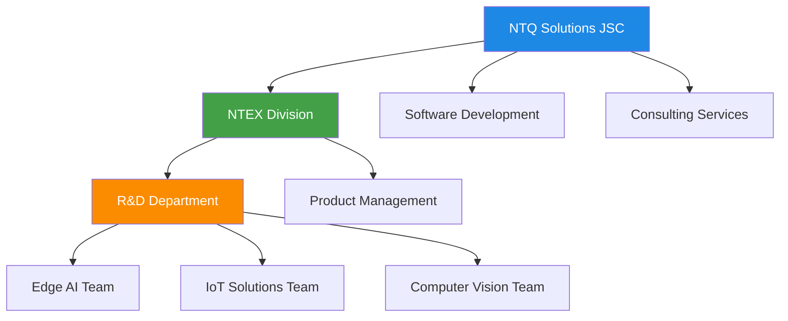
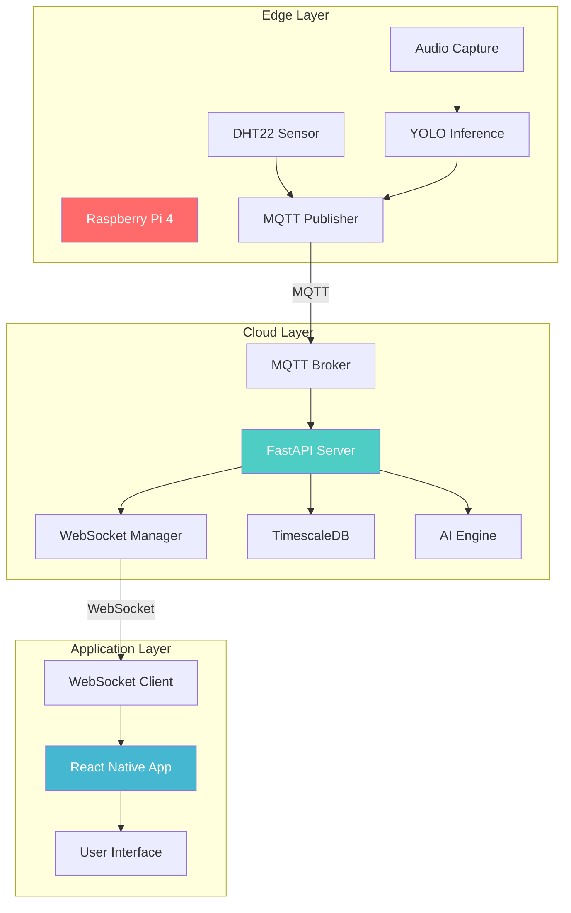
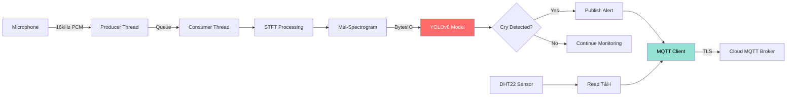
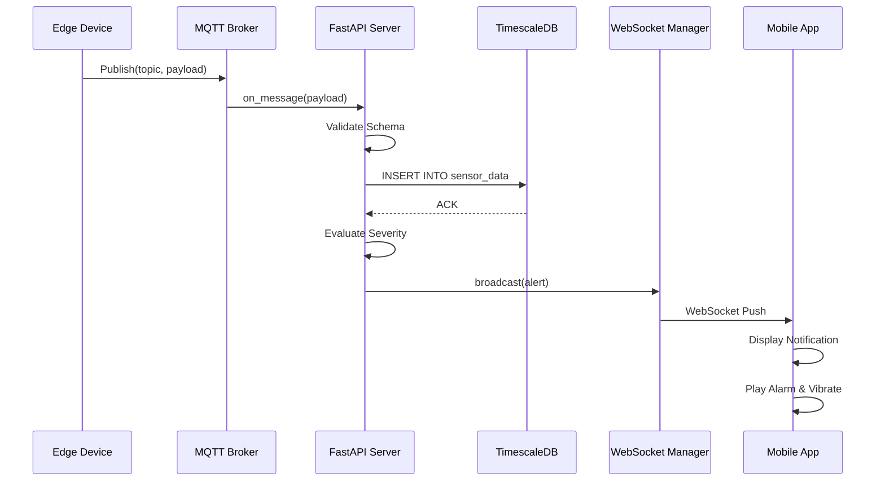
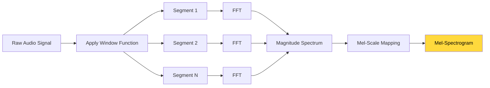

# Figures Directory

This directory contains all diagrams and images used in the internship report.

## Required Images (Generated from Mermaid Diagrams)

### 1. org_structure.png
**Location:** Chapter 1 - Overview
**Mermaid Code:**


### 2. system_architecture.png
**Location:** Chapter 3 - Implementation
**Mermaid Code:**


### 3. edge_pipeline.png
**Location:** Chapter 3 - Implementation
**Mermaid Code:**


### 4. backend_flow.png
**Location:** Chapter 3 - Implementation
**Mermaid Code:**


### 5. stft_process.png
**Location:** Chapter 2 - Theory
**Mermaid Code:**


## How to Generate PNG Images

### Option 1: Using Mermaid Live Editor (Recommended)
1. Visit https://mermaid.live/
2. Paste the Mermaid code for each diagram
3. Click "Export" → "PNG"
4. Save the PNG file with the corresponding name in this directory

### Option 2: Using mermaid-cli
```bash
# Install mermaid-cli
npm install -g @mermaid-js/mermaid-cli

# Generate PNG (example)
mmdc -i diagram.mmd -o org_structure.png -b transparent -w 1200
```

### Option 3: Using VS Code Extension
1. Install "Markdown Preview Mermaid Support" extension
2. Create a markdown file with the mermaid code
3. Use the extension to export to PNG

## Image Specifications
- **Format:** PNG
- **Background:** Transparent or White
- **Width:** 1200-1600px (for good quality in PDF)
- **DPI:** 300 (for print quality)
